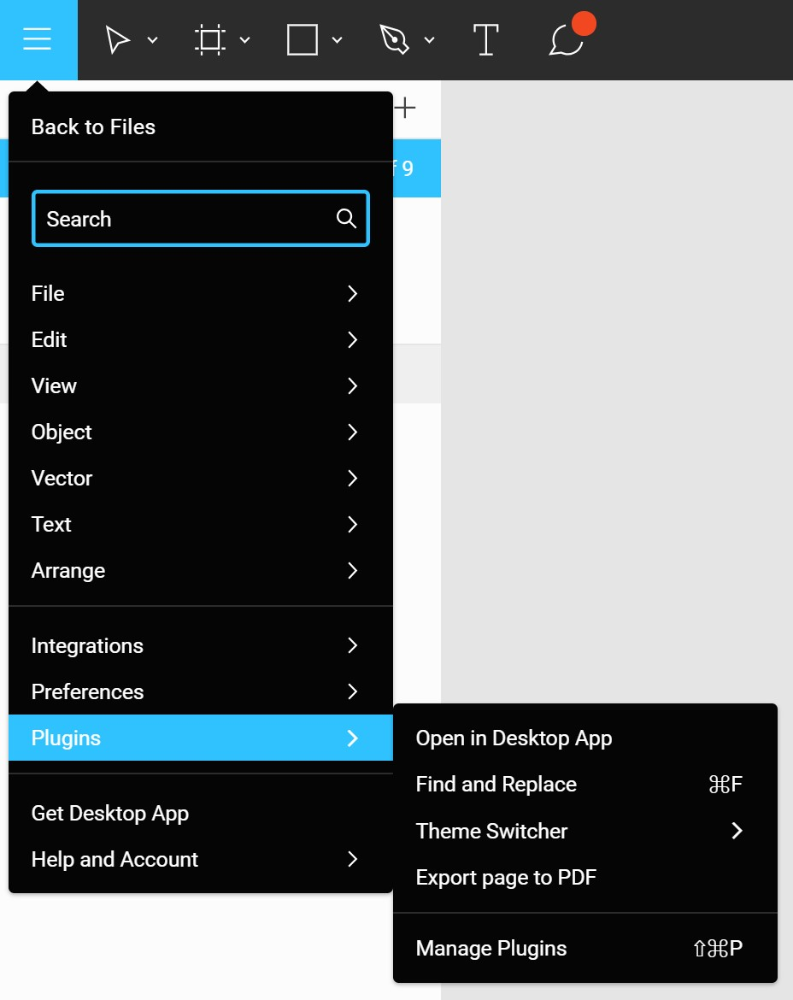

# Create UI

Use these functions to set up your plugin and insert menu items for users to interact with.

## createPluginsMenuItem

Create an item in the Plugins menu.



<!-- prettier-ignore -->
```javascript
figmaPlugin.createPluginsMenuItem(
	itemLabel,
	triggerFunction,
	condition,
	shortcut,
	submenuItems
);
```

- **itemLabel** (`String`): The label of the menu item to be added.
- **triggerFunction** (`Function`): The function to trigger when the menu item is clicked. If there are sub-menus, this trigger function will not be runned on click.
- **condition (optional)** (`Function`): Condition that needs to pass for the item to show in the menu. Menu item will only show when this condition function returns `true`. Pass `null` if no condition is needed.
- **shortcut (optional)** (`Shortcut`): Pass in a keyboard shortcut object to show it alongside the label. Remember to use `createKeyboardShortcut` to actually attach the command to a keyboard shortcut event. Pass `null` if no shortcut is needed to be displayed.
- **submenuItems (optional)** (`Array`): Pass in an array of `submenuItem` objects to create sub-menu items branching off the menu item. Pass `null` if no sub-menu is needed.
