# UI Functions

Use these functions to set up your plugin and insert menu items for users to interact with. Plugins are recommended to have at least a Plugins menu item, and optionally add a context menu item and/or keyboard shortcut if necessary.

## createPluginsMenuItem

Create an item in the **Plugins** menu.

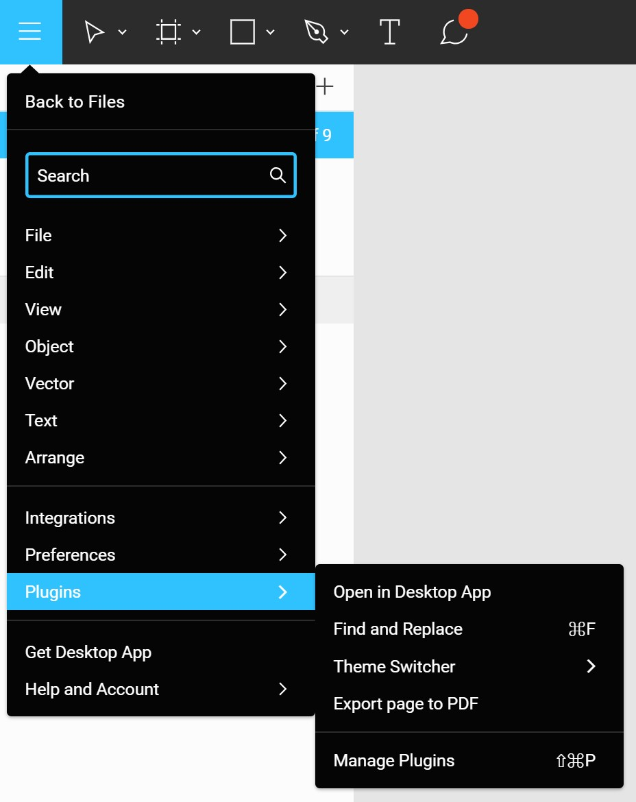

<!-- prettier-ignore -->
```javascript
figmaPlugin.createPluginsMenuItem(
	itemLabel,
	triggerFunction,
	condition,
	shortcut,
	submenuItems
);
```

- **itemLabel** (`String`): The label of the menu item to be added.
- **triggerFunction** (`Function`): The function to trigger when the menu item is clicked. If there are sub-menus, this trigger function will not be runned on click.
- **condition (optional)** (`Function`): Condition that needs to pass for the item to show in the menu. Menu item will only show when this condition function returns `true`. Pass `null` if no condition is needed.
- **shortcut (optional)** (`Shortcut`): Pass in a keyboard shortcut object to show it alongside the label. Remember to use `createKeyboardShortcut` to actually attach the command to a keyboard shortcut event. Pass `null` if no shortcut is needed to be displayed.

<details><summary>Click to see the Shortcut object format</summary>
<p>

```
{
	mac : {
		control: <boolean>,
		option: <boolean>,
		shift: <boolean>,
		command: <boolean>,
		key: <String>
	},
	windows: {
		control: <boolean>,
		alt: <boolean>,
		shift: <boolean>,
		key: <String>
	}
}
```

</p>
</details>

- **submenuItems (optional)** (`Array`): Pass in an array of `submenuItem` objects to create sub-menu items branching off the menu item. Pass `null` if no sub-menu is needed.

<details><summary>Click to see the submenuItems object format</summary>
<p>

```
{
	itemLabel: <String>,
	triggerFunction: <Function>,
	condition: <Function> (optional),
	shortcut: <Shortcut> (optional)
}
```

</p>
</details>

<!-- prettier-ignore -->
```javascript
// Example code for creating a simple  Plugins menu item:
figmaPlugin.createPluginsMenuItem(
	'Hello world!',
	() => alert('Hello world!')
);

// Example code for creating a simple Plugins menu item with sub-menu:
figmaPlugin.createPluginsMenuItem(
	'Hello world!',
	null,
	null,
	null,
	[
		{
			itemLabel: 'Hello',
			triggerFunction: () => alert('Hello')
		},
		{
			itemLabel: 'World',
			triggerFunction: () => alert('World')
		}
	]
);
```

## createContextMenuItem

Create an item in a specific context menu. Here are the supported menu types (Click to see image):

<details>
	<summary><b>Canvas</b></summary>
	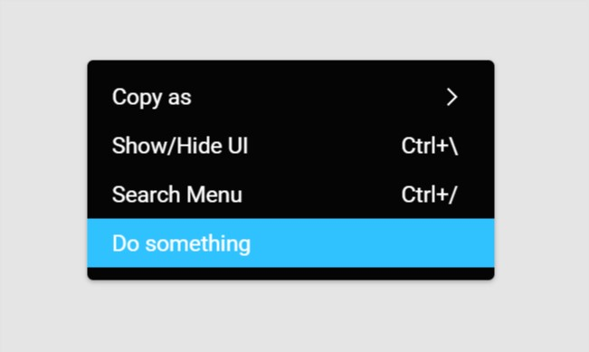
</details>

<details>
	<summary><b>Selection</b></summary>
	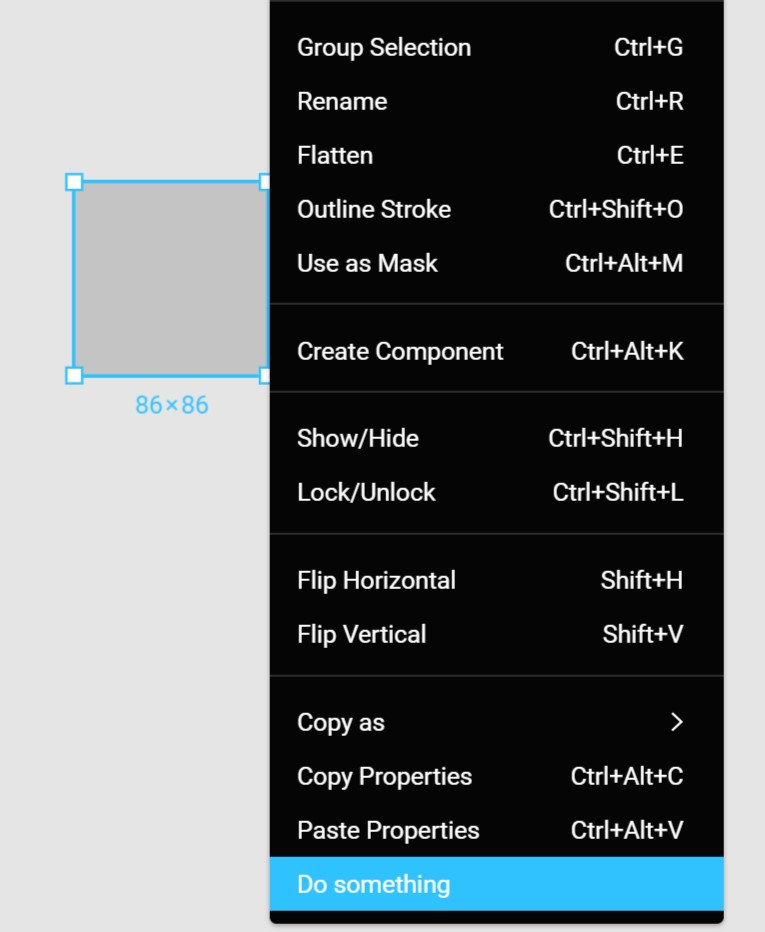
</details>

<details>
	<summary><b>ObjectsPane</b></summary>
	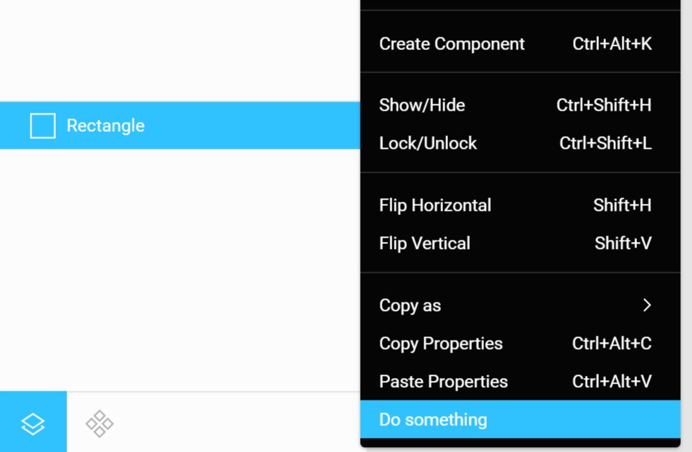
</details>

<details>
	<summary><b>Page</b></summary>
	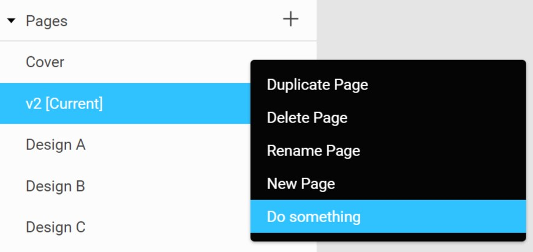
</details>

<details>
	<summary><b>Filename</b></summary>
	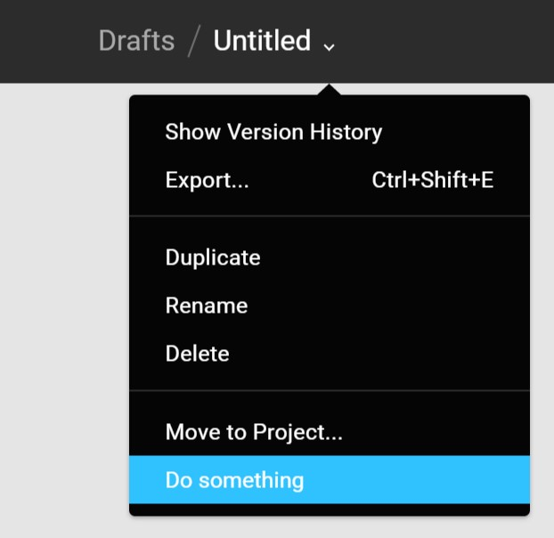
</details>

<details>
	<summary><b>Version</b></summary>
	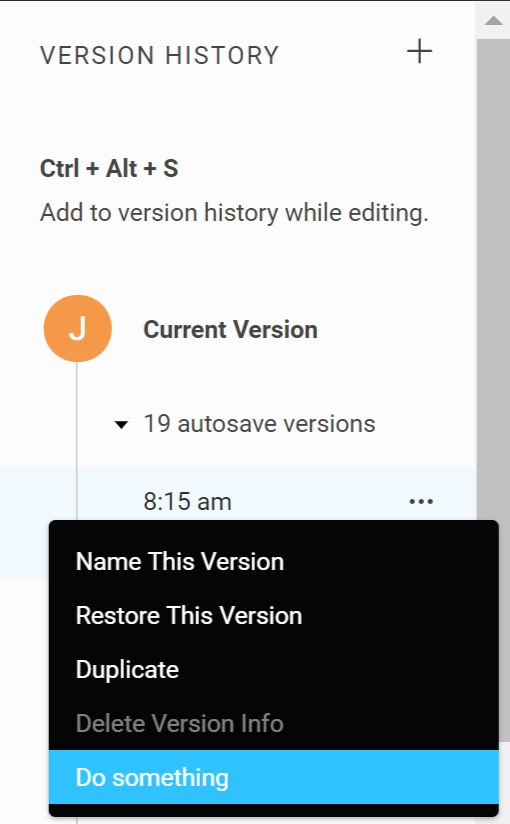
</details>

<details>
	<summary><b>File</b></summary>
	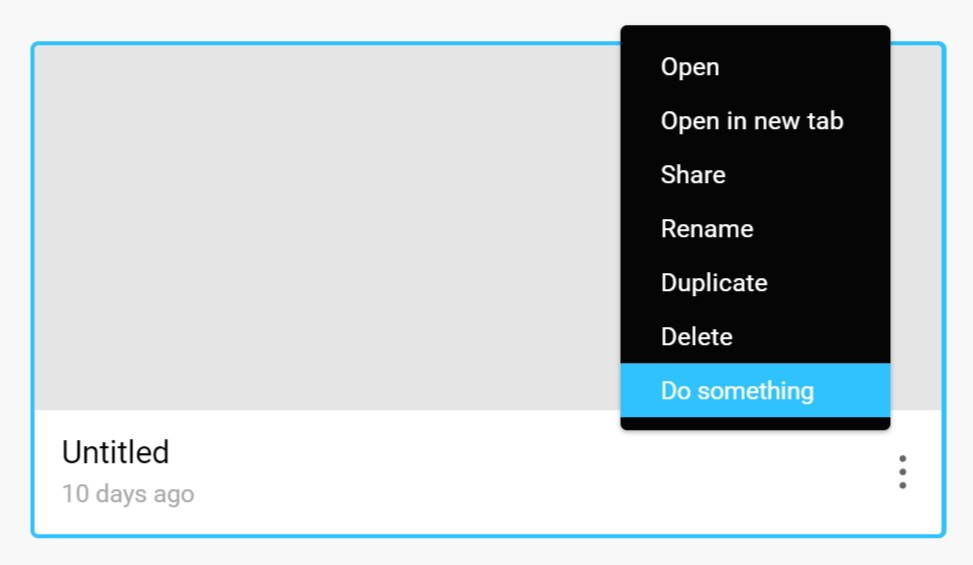
</details>

Use `figmaPlugin.createContextMenuItem.` + **Menu Type** to create an item in the given type of menu.

For example, to create a Canvas menu item:

<!-- prettier-ignore -->
```javascript
figmaPlugin.createContextMenuItem.Canvas(
	itemLabel,
	triggerFunction,
	condition,
	shortcut,
	submenuItems
);
```

- **itemLabel** (`String`): The label of the menu item to be added.
- **triggerFunction** (`Function`): The function to trigger when the menu item is clicked. If there are sub-menus, this trigger function will not be runned on click.
- **condition (optional)** (`Function`): Condition that needs to pass for the item to show in the menu. Menu item will only show when this condition function returns `true`. Pass `null` if no condition is needed.
- **shortcut (optional)** (`Shortcut`): Pass in a keyboard shortcut object to show it alongside the label. Remember to use `createKeyboardShortcut` to actually attach the command to a keyboard shortcut event. Pass `null` if no shortcut is needed to be displayed.

<details><summary>Click to see the Shortcut object format</summary>
<p>

```
{
	mac : {
		control: <boolean>,
		option: <boolean>,
		shift: <boolean>,
		command: <boolean>,
		key: <String>
	},
	windows: {
		control: <boolean>,
		alt: <boolean>,
		shift: <boolean>,
		key: <String>
	}
}
```

</p>
</details>

- **submenuItems (optional)** (`Array`): Pass in an array of `submenuItem` objects to create sub-menu items branching off the menu item. Pass `null` if no sub-menu is needed.

<details><summary>Click to see the submenuItems object format</summary>
<p>

```
{
	itemLabel: <String>,
	triggerFunction: <Function>,
	condition: <Function> (optional),
	shortcut: <Shortcut> (optional)
}
```

</p>
</details>

<!-- prettier-ignore -->
```javascript
// Example code for creating a simple Canvas menu item:
figmaPlugin.createContextMenuItem.Canvas(
	'Hello world!',
	() => alert('Hello world!')
);

// Example code for creating a simple Canvas menu item with sub-menu:
figmaPlugin.createContextMenuItem.Canvas(
	'Hello world!',
	null,
	null,
	null,
	[
		{
			itemLabel: 'Hello',
			triggerFunction: () => alert('Hello')
		},
		{
			itemLabel: 'World',
			triggerFunction: () => alert('World')
		}
	]
);
```

## createKeyboardShortcut

Attach a function to a keyboard shortcut. Remember to include a shortcut hint in the Plugins menu/context menu item (See above).

<!-- prettier-ignore -->
```javascript
figmaPlugin.createKeyboardShortcut(shortcut, triggerFunction);
```

- **shortcut** (`Shortcut`): An object defining the keyboard shortcut for both Mac and Windows.

<details><summary>Click to see the Shortcut object format</summary>
<p>

```
{
	mac : {
		control: <boolean>,
		option: <boolean>,
		shift: <boolean>,
		command: <boolean>,
		key: <String>
	},
	windows: {
		control: <boolean>,
		alt: <boolean>,
		shift: <boolean>,
		key: <String>
	}
}
```

</p>
</details>

- **triggerFunction** (`Function`): The function to trigger when the shortcut is pressed.

```javascript
// Example code for creating a simple keyboard shortcut:
figmaPlugin.createKeyboardShortcut(
	{
		mac: {
			command: true,
			shift: true,
			key: 'H'
		},
		windows: {
			control: true,
			shift: true,
			key: 'H'
		}
	},
	() => alert('Hello world!')
);
```

## showUI

Show a Figma styled modal where you can attach your UI onto.

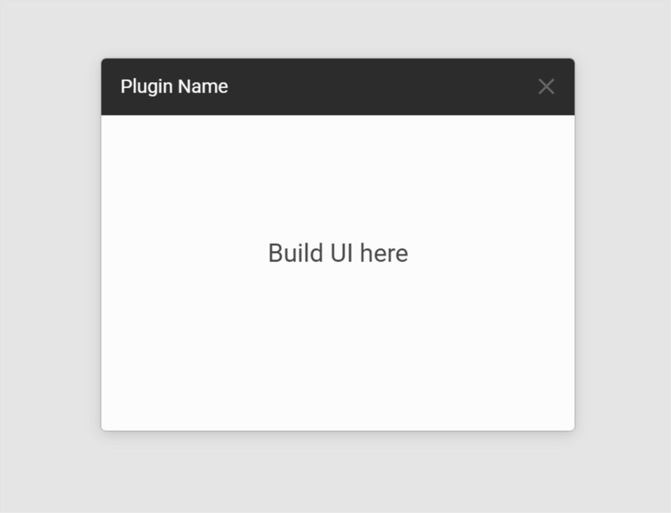

```javascript
figmaPlugin.showUI(modalTitle, callback, width, height, positionX, positionY, draggable);
```

- **modalTitle** (`String`): The title to show on the modal header.
- **callback** (`Function`): The callback function that returns after the modal is opened. `modalElement` is passed as an argument to allow UI attachment (See example below).
- **width (optional)** (`Number`): Width of the modal in px. Default: `300`
- **height (optional)** (`Number || String`): Height of the modal in px or 'auto' (Height of the inner elements). Default: `auto`
- **positionX (optional)** (`Number`): Horizontal position in % relative to the screen, ranges from 0 to 1. Default: `0.5` (Center of the screen)
- **positionY (optional)** (`Number`): Vertical position in % relative to the screen, ranges from 0 to 1. Default: `0.5` (Center of the screen)
- **draggable (optional)** (`Boolean`): Whether the modal is draggable. A non-draggable modal also comes with a dark overlay. Default: `true`

<!-- prettier-ignore -->
```javascript
// Attaching UI using pure HTML/Javascript
figmaPlugin.showUI(
	'Hello world',
	(modalElement) => {
		const UI = document.createElement('div');
		UI.innerHTML = '<h1>Hello world</h1>';
		modalElement.parentNode.replaceChild(UI, modalElement);
	}
);

// Attaching UI using React (React and ReactDOM are available in figmaPlugin.React and figmaPlugin.ReactDOM)
figmaPlugin.showUI(
	'Hello world',
	(modalElement) => {
		figmaPlugin.ReactDOM.render('Hello, world!', modalElement);
	}
);

// Attaching UI using Vue (Vue is available in figmaPlugin.Vue)
figmaPlugin.showUI(
	'Hello world',
	(modalElement) => {
		new figmaPlugin.vue({
			el: modalElement,
			template: `<h1>Hello world</h1>`
		})
	}
);
```

## hideUI

Hide an opened modal by providing its title.

```javascript
figmaPlugin.hideUI(modalTitle);
```

- **modalTitle** (`String`): The title of the modal you want to hide.

## addTooltip

Attach a hover tooltip to a DOM element in your UI.

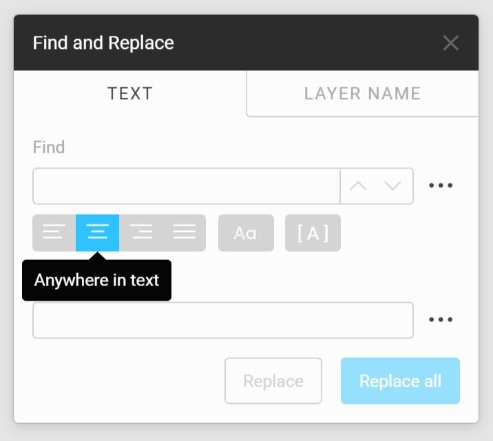

```javascript
figmaPlugin.addTooltip(element, tooltipText, showAfterDelay);
```

- **element** (`DOMElement`): The DOM element to show the tooltip when hovered. E.g. an icon button.
- **tooltipText** (`String`): The text to show in the tooltip.
- **showAfterDelay (optional)** (`Number`): Time in milliseconds to wait before showing the tooltip. If not provided, the tooltip will show immediately on hover.

## showToast

Show a notification message (Toast) at the bottom of the screen, with an optional action button.

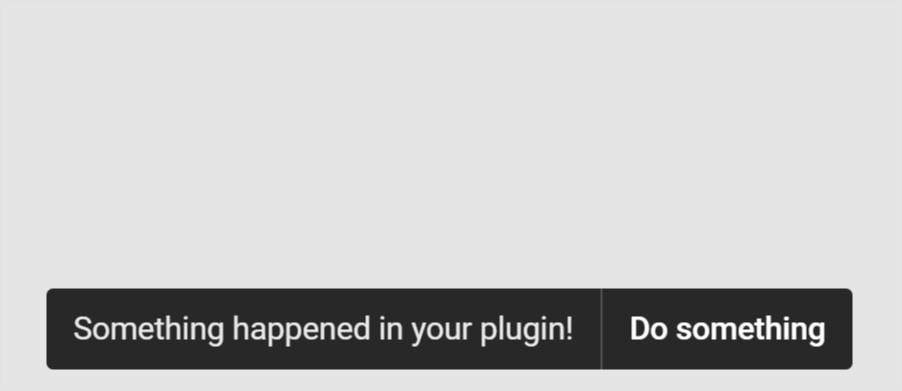

<!-- prettier-ignore -->
```javascript
figmaPlugin.showToast(
	message,
	timeoutInSeconds,
	buttonText,
	buttonAction
);
```

- **message** (`String`): Message to show in the toast.
- **timeoutInSeconds (optional)** (`Number`): Number of seconds the toast will stay on the screen. Default: `3`
- **buttonText (optional)** (`String`): The label of the action button. Must be accompanied by `buttonAction`.
- **buttonAction (optional)** (`Function`): Function to trigger when the action button is clicked. Must be accompanied by `buttonText`.

<!-- prettier-ignore -->
```javascript
// Example code for showing the toast above:
figmaPlugin.showToast(
	'Something happened in your plugin!',
	3,
	'Do something',
	() => alert('You clicked the action button!')
)
```
